# M1.1 Stage A · Review Skill v0.1 spec brief

> Stage A 的目标是 **能在 5 分钟内向一个没看过 PAID 的人讲清整个 review
> skill 的结构 + 核心风险**。完整 architecture 在 04 文档（700 行）；这份是
> 浓缩版给设计 review 用。
>
> **draft 3 修订**（draft 2 是 Ⓜ1-Ⓜ12，draft 3 是 Ⓜ13-Ⓜ22）：
> - Ⓜ13 **状态图统一 SCAN 可见性**：SCAN 是显式 stage，§6 加 SCAN 行明确
>   外部输入（无）+ progress 输出 + INTAKE 回退；SUBJECT 行明确输出可能是
>   "0+ 条 SCAN progress + 最终 1 条 QA finding"
> - Ⓜ14 **MERGE → GATE 加注解**：GATE 是 PAID 自己 form-check 重扫 4 柱，
>   不是再问 junior（draft 2 漏说，reviewer 误以为多一层审批）
> - Ⓜ15 **rounds_exhausted 走 force_close 路径**：内部统一调
>   `force_close(reason="rounds_exhausted")` → verdict=FORCED_PARTIAL，
>   不新增 verdict 类型保持 5 个简洁
> - Ⓜ16 **cursor.json `current_id` 不在 `pending`**：例子改 + 推进规则
>   说明
> - Ⓜ17 **SCAN 0 findings 短路**：状态图加 SCAN → CLOSED (no_findings,
>   verdict=READY) 边
> - Ⓜ18 **junior `/review cancel` 强制关闭**：入口路径加；audit 留 trace
> - Ⓜ19 **R7 升级到强制 fcntl.flock**：v0.1 不接受 race；设计 §15
>   跳过项里"fcntl 文件锁"删除
> - Ⓜ20 **stage × verdict 有效性矩阵**（INV-5 附表）
> - Ⓜ21 **TTL cron 具体 entry**（§11）
> - Ⓜ22 **brief "建议不开会" 跟 verdict 无关**：§12 加 note 说明 verdict
>   是材料 decision-readiness 判定，"不开会"是 owner-facing recommendation

---

## 1. 角色 + 边界

| 谁 | 在 PAID 里是什么 | review 里是什么 |
|---|---|---|
| Owner | `paid.identity.Owner` | Responder + Admin（合体）|
| Junior counterparty | `cp.role="junior"` | Requester（提交 draft 的人）|

**v0.1 范围**：单 owner，每个 junior cp **最多 1 个并发 session**，session 全在 1:1 DM 里走完。多 Responder / 群聊 / 并发 session 留 v1。

---

## 2. 触发面

**唯一入口**：junior DM 里以 `/review` 或 `/r` 开头的消息。

```
junior 发: /review Q3 营销预算草稿
           ↓
PAID plugin pre_llm_call hook 看到 user_message.startswith('/review')
           ↓
路由到 paid_review.api (绕过 classifier / decision)
```

**classifier 自动触发延后**：
- `Classification.needs_review` 字段保持，LLM 仍然填
- `decision.decide_action` v0.1 **不走** `needs_review=True → state=review`
- 单元测试里这条规则 `pytest.skip(reason="M1 v0.1 disabled until M1.7")`
- M1.7 子任务跟踪：M1 dogfood 一周后单独评估开关

**回归保证**：不发 `/review` 的所有 inbound 走完全不变的旧链路。

---

## 3. 7 stage 状态机

```mermaid
stateDiagram-v2
    [*] --> INTAKE : /review trigger
    INTAKE --> SUBJECT : ingest_ok
    INTAKE --> INTAKE : ingest_fail (retry friendly)

    SUBJECT --> SCAN : topic_confirmed

    SCAN --> QA : findings_ready (>=1 finding)
    SCAN --> CLOSED : findings=0 (verdict=READY) %% Ⓜ17 — 短路, 跳过 QA/MERGE/GATE
    SCAN --> SUBJECT : llm_timeout (after 2 retries)

    QA --> QA : finding_replied (cursor advance)
    QA --> MERGE : done (perm=suggest, all findings replied)
    QA --> GATE : done (perm=none, all findings replied)
    %% Ⓜ15 — rounds_exhausted 走 force_close 路径，不直接连 CLOSED
    %% (统一 termination 语义；INV-5 verdict=FORCED_PARTIAL)

    MERGE --> GATE : revised_accepted %% Ⓜ14 GATE = PAID self form-check, NOT another junior step
    MERGE --> QA : revised_rejected (rounds += 1)

    GATE --> CLOSED : verdict in {READY, READY_WITH_OPEN_ITEMS}
    GATE --> QA : verdict=FAIL (Intent gate fail; rounds += 1)

    %% force_close is universal escape — applies to ALL non-CLOSED stages.
    %% Triggered by: owner /review close <sid>, junior /review cancel (Ⓜ18),
    %% TTL sweep (§11), rounds_exhausted (Ⓜ15), llm_cost > $1 (R3).
    INTAKE --> CLOSED : force_close
    SUBJECT --> CLOSED : force_close
    SCAN --> CLOSED : force_close
    QA --> CLOSED : force_close
    MERGE --> CLOSED : force_close
    GATE --> CLOSED : force_close

    CLOSED --> [*]
```



### 3.1 状态机 Invariants

> 任何代码改动违反下面任意一条都视为状态机 bug。Sprint A 单测覆盖每条。

**INV-1 · force_close 全 stage 通用**
`api.force_close(sid, reason)` 从任何非 CLOSED stage 调都合法；强制走到 CLOSED 并设 `verdict=FORCED_PARTIAL` + `forced=True` + `closed_at=now`。

**INV-2 · rounds 计数 + 超限自动 force_close**（Ⓜ15 强化）
`MERGE → QA`（revised rejected）和 `GATE → QA`（verdict=FAIL）都计 round。即 `rounds` 是"进 QA 的总次数"。
- 默认 `max_rounds=3`，env `PAID_REVIEW_MAX_ROUNDS=5` 可调（hard ceiling 5）
- `rounds >= max_rounds` 进 QA 时 → 内部调 `force_close(sid, reason="rounds_exhausted")`，**不新增 verdict 类型**，仍然 verdict=FORCED_PARTIAL（INV-5）—— reason 字段区分

**INV-3 · QA 不能 done 当还有 open finding**
`done` (perm=suggest → MERGE 或 perm=none → GATE) 触发条件：cursor.pending 空 AND cursor.deferred 空 AND **所有 annotations.jsonl 里 status=open 的 finding 都已 reply**。有 open → bot 回 `"还有 N 条 finding 没回，继续 (a)/(b)/(c) 或 (skip) 跳过"`，stage 不变。

**INV-4 · CLOSED 后 cp.active_review_session 清空**
不论怎么 close，plugin glue 必须 `identity.clear_active_review_session(cp, archive=...)`。同 cp 下一条 `/review` = 全新 sid。

**INV-5 · stage × verdict 有效性矩阵**（Ⓜ20 详细化）

| verdict ↓ \\ stage → | INTAKE | SUBJECT | SCAN | QA | MERGE | GATE | CLOSED |
|---|---|---|---|---|---|---|---|
| PENDING | ✅ | ✅ | ✅ | ✅ | ✅ | ✅ | ❌ |
| READY | ❌ | ❌ | ❌ | ❌ | ❌ | ✅ | ✅ |
| READY_WITH_OPEN_ITEMS | ❌ | ❌ | ❌ | ❌ | ❌ | ✅ | ✅ |
| FAIL | ❌ | ❌ | ❌ | ❌ | ❌ | ✅ (transient) | ❌ |
| FORCED_PARTIAL | ❌ | ❌ | ❌ | ❌ | ❌ | ❌ | ✅ |

读法：
- `PENDING`：所有非终态默认值
- `READY` / `READY_WITH_OPEN_ITEMS`：只在 GATE pass 后写入；CLOSED 时保持
- `FAIL`：**仅在 GATE→QA 转移瞬间存在**（GATE 跑出 FAIL 后立即 += rounds + 退回 QA + verdict 复位 PENDING）
- `FORCED_PARTIAL`：force_close 唯一终态 verdict
- 任何"❌"组合在 self-check 单测里抛 `InvalidStateError`

**INV-6 · concurrent intake 原子保护**（Ⓜ19 强化）
`identity.set_active_review_session(cp, sid)` v0.1 **必须**用 `fcntl.flock(LOCK_EX)` 在 `cp.profile.json` 上做原子 read-then-write —— 不接受 race。两个并发 `/review` 一个赢一个抛 `ReviewSessionConflict`。

---

## 4. SessionState dataclass

```python
@dataclass
class SessionState:
    sid: str                       # uuid4 short (12 chars)
    schema_version: int = 1
    created_at: str = ""
    updated_at: str = ""
    last_inbound_at: str = ""      # TTL 计算锚点；任何 junior reply 后 stamp
    cp_id: str = ""
    owner_id: str = ""
    platform: str = ""             # tg | lark | slack
    stage: Stage = "INTAKE"
    subject: str | None = None
    rounds: int = 0
    max_rounds: int = 3
    verdict: Verdict = "PENDING"
    doc_edit_permission: Literal["none","suggest","direct"] = "suggest"
    forced: bool = False
    forced_reason: str = ""        # "rounds_exhausted" / "TTL_expired" /
                                   # "owner_force" / "junior_cancel" / "cost_cap"
    closed_at: str | None = None
    last_event_kind: str = ""
    llm_cost_usd: float = 0.0
    trace_id: str | None = None
```

存 `~/.hermes/paid/review/sessions/<sid>/meta.json`。
所有变更走 `state.transition(s, new_stage)` —— 单点校验合法转移 + INV-5 矩阵 + stamp `updated_at`。

`Stage = Literal["INTAKE","SUBJECT","SCAN","QA","MERGE","GATE","CLOSED"]`
`Verdict = Literal["READY","READY_WITH_OPEN_ITEMS","FORCED_PARTIAL","FAIL","PENDING"]`

---

## 5. `paid_review/api.py` 5 函数签名

```python
@dataclass
class ReviewReply:
    text: str                      # 要发给 junior 的字面文本（已套选项块）
    stage: Stage
    event_kind: str                # intake_ack / subject_ask / finding /
                                   # scan_progress / close_propose / cancelled / ...
    closed: bool = False           # True 时调用方应清 active_review_session


class IntakeRefused(Exception):
    """intake() raises if cp already has active_review_session."""

class ReviewSessionConflict(Exception):
    """fcntl.flock conflict on cp.profile.json (Ⓜ19)."""


def intake(*, cp, initial_message, attachments, classification=None) -> str:
    """Create a session, return sid. Atomic via fcntl.flock on
    cp.profile.json (INV-6). Raises IntakeRefused if cp already has
    active_review_session, or ReviewSessionConflict on lock contention."""

def handle_inbound(sid: str, text: str, hook_kwargs: dict) -> ReviewReply:
    """Drive state machine one step. Stamps state.last_inbound_at = now."""

def list_open(owner_id: str | None = None) -> str:
    """Markdown table for /review pending owner cmd."""

def show(sid: str) -> str:
    """Markdown summary of one session for /review show <id>."""

def force_close(sid: str, *, reason: str = "owner_force") -> str:
    """Force-close from ANY non-CLOSED stage. verdict=FORCED_PARTIAL,
    forced=True, forced_reason=reason, closed_at=now (INV-5).

    Common reasons:
      'owner_force'        — /review close <sid> from owner
      'junior_cancel'      — /review cancel from junior (Ⓜ18)
      'rounds_exhausted'   — INV-2 max_rounds reached
      'TTL_expired'        — sweep_review_sessions cron (§11)
      'cost_cap'           — single-session $1 ceiling (R3)
    """
```

**调用约定**：
- plugin glue (Sprint D) **同步**调这 5 个 function
- 所有 LLM call 在 `api.py` **内部**走 `paid.hermes_io.call_llm`（自动写 cost ledger）
- `api.py` 函数**永不抛异常进 plugin**（除显式 `IntakeRefused` / `ReviewSessionConflict`）：包 try/except，错误时 return `ReviewReply(text="<friendly>", stage=...)` + log `kind="review.error"`

---

## 6. plugin ↔ skill 接口逐 stage 输入输出

| Stage | plugin → skill 输入 | skill → plugin 输出 | 异常路径 |
|---|---|---|---|
| **入口** | text.startswith('/review' or '/r')；plugin 必先查 `cp.active_review_session`：① 已存在 + text == "/review cancel" → 调 `force_close(sid, reason="junior_cancel")` + reply `"已关闭，发 /review <subject> 开新一轮"`（Ⓜ18）；② 已存在 + text 不是 cancel → reply `"你已有进行中的 review session: /review show <sid>，先 /review cancel 再开新的"`；③ 无 sid → 调 `intake()` | (跳过) | `IntakeRefused` 视作 ②；`ReviewSessionConflict` → `"系统繁忙再发一次"` |
| **INTAKE** | `cp`, `initial_message`, `attachments` | `ReviewReply(text=<subject 候选选项块>, stage=SUBJECT)` | ingest 失败 → `text=<friendly>, stage=INTAKE`（保留等用户重发）|
| **SUBJECT** | session 中 junior 回 `a/b/c/pass/custom...` | **可能多条**（Ⓜ13）：(a) 0+ 条 `ReviewReply(stage=SCAN, event_kind=scan_progress)` 中间进度 + (b) 最终 1 条 `ReviewReply(stage=QA, event_kind=finding)` 第一条 finding —— **或** stage=CLOSED if findings=0 (Ⓜ17) | 不可解析回复 → `text="不懂，请回 a/b/c 或自由文本"`, 不前进 |
| **SCAN** | （内部 stage，无外部输入；SUBJECT confirm 后立刻同步跑 4-pillar+sim）（Ⓜ13）| 见 SUBJECT 输出列；scan 跑 > 60s 中间发 `ReviewReply(text=进度, stage=SCAN, event_kind=scan_progress)` plugin 收到此类 reply 时**只 send 不写 meta**（Ⓜ8） | LLM 超时 retry 2 次仍失败 → `text="脑子卡了再发一次", stage=SUBJECT` 回退；findings=0 → `force_close(sid, reason="no_findings")` + verdict 改成 `READY`（**例外**：这是唯一 force_close 设 READY 而不是 FORCED_PARTIAL 的情况，因为材料确实 decision-ready）|
| **QA** | junior 回复（短码 / 自由文本）| `ReviewReply(text=<下一条 finding 或 close_propose>, stage=QA)` | rounds >= max_rounds → `force_close(sid, reason="rounds_exhausted")`，return `ReviewReply(text="3 轮上限，剩余 finding 进 open_items", stage=CLOSED, closed=True)` (INV-2) |
| **QA done 触发** | junior 回 `done` | `done` 条件：cursor.pending 空 AND cursor.deferred 空 AND 所有 open finding 已 reply (INV-3)。满足 → 进 MERGE (perm=suggest) / GATE (perm=none)；不满足 → `text="还有 N 条没回，继续 (a)/(b)/(c) 或 (skip)"` 不变 |
| **MERGE** | junior 对 revised.md 回 `a/b/c/(custom)` | `ReviewReply(text=<gate 结果>, stage=GATE)`。**注**：进 GATE **不是再问 junior**——GATE 是 PAID 自己的 final-gate form-check（重扫 4 柱看是否回归）（Ⓜ14） | revised 生成失败 → 退回 QA `rounds += 1` 让 junior 自上传 final |
| **GATE** | （内部 form-check，不直接外部触发）| `ReviewReply(text="<6 节 brief delivered>"+done, stage=CLOSED, closed=True)` | verdict=FAIL（Intent 柱回归）→ 退回 QA `rounds += 1` 加新 finding |
| **CLOSED** | junior 之后再发任何东西 | `ReviewReply(text="<session 已关>...", stage=CLOSED, closed=True)` | 不重开 sid，提示 `/review <new>` |

**plugin 唯一职责**：
1. **入口并发保护 + cancel 路径**（Ⓜ18 / Ⓜ19）按上表入口行
2. `cp.active_review_session != ""` 且 text 不以 `/review` 开头 → 调 `api.handle_inbound(sid, text, hook_kwargs)`
3. 收 `ReviewReply` → return `{"reply_override": reply.text, "skip_llm": True}` 给 hermes
4. **stage=SCAN + event_kind=scan_progress**：只 return reply_override，**不**调 `clear_active_review_session`
5. `reply.closed=True` → 调 `identity.clear_active_review_session(cp, archive=...)`

skill **永不**直接调 hermes_io.send_dm。例外：MERGE/GATE/CLOSED 把 6 节 brief deliver 给 owner 时**走 plugin 帮转**。

---

## 7. 文件树（运行时）

```
~/.hermes/paid/                     ← PAID 主目录（已存在）
├── owner.json
├── counterparties/<cp_id>/profile.json   (active_review_session 字段已 v2)
├── audit_log.jsonl                      (kind: review.* 共享同 audit)
└── review/                              ← skill 数据子目录
    ├── installed.json
    ├── review_rules.md                  (live, owner editable)
    ├── responder_profile.md             (live; install 时从 persona+sop 拼初稿)
    ├── admin_style.md
    ├── delivery_targets.json
    └── sessions/
        ├── <sid>/
        │   ├── meta.json                ← SessionState
        │   ├── input/                    ← 原始附件
        │   ├── normalized.md
        │   ├── annotations.jsonl
        │   ├── cursor.json
        │   ├── dissent.md
        │   ├── final_gate.json
        │   ├── final/{revised.md, <primary>.md}
        │   ├── summary.md
        │   ├── summary_audit.md
        │   ├── conversation.jsonl
        │   └── frozen/{review_rules,responder_profile,admin_style}.md
        └── _closed/<YYYY-MM>/<sid>/...
```

---

## 8. ⚠️ 风险点

### R1 · `pre_llm_call` 重路由把 J2 主链路打回归
所有 `text.startswith('/review')` inbound 必须 **跳过** classifier + decision，但其他 99% inbound 不能受影响。**Mitigation**：Sprint D 完成必跑 PAID 既有 `tests/test_alert_owner.py + test_send_dm_dispatch.py + test_review_integration.py` —— 红任何一个回滚 D commit。

### R2 · cp profile.active_review_session 字段没清干净
session close 时若 plugin 没 catch `reply.closed=True`，下次同 junior 任何消息都被路由进死 sid。**Mitigation**：plugin glue try/except 包 dispatch + identity 加 self-heal "session_id 不在 sessions/ 找不到 → 自动清"。

### R3 · LLM 调用 cost 失控
**Mitigation**：单 session > $1.0 强制 `force_close(reason="cost_cap")`；v1.2.3 daily cron 兜底。

### R4 · Cross-cp 数据泄漏
**Mitigation**：每个 LLM call user message 只能含本 sid 文件夹 + cp.profile.json 自己的。Sprint A 加跨 sid 隔离单测。

### R5 · Ingest backend 失败把 stage 卡住
**Mitigation**：每个 backend 独立 try/except；全部失败 → friendly fallback "贴正文吧"，session 留 INTAKE。

### R6 · Junior 失联，session 永远卡住
**Mitigation**：见 §11 — `last_inbound_at` + 24h TTL sweep 自动 force_close。

### R7 · 同 cp 并发请求竞态（Ⓜ19 升级）
异步 IM 不保证消息有序。两个并发 hook 都看到 `active_review_session=""`，都进 intake() 创建 sid → state corruption。**Mitigation**：v0.1 **必须**实做 `identity.set_active_review_session` 用 `fcntl.flock(LOCK_EX)` 在 `cp.profile.json` 上做原子 read-then-write（INV-6）。两个并发请求一个赢一个抛 `ReviewSessionConflict`，plugin 端友好 reply。**不接受 race**——商业化产品级要求。

### R8 · 进程崩溃后状态丢失
**Mitigation**：见 §13 — atomic write + lazy recovery hook。

---

## 9. Stage A 通过 → Stage B sprint 顺序

| Sprint | 内容 | 完成判据 |
|---|---|---|
| A | state.py / cursor.py / annotation.py + api.py 骨架 + happy path 集成测试 + INV-1~6 self-check 单测 + 跨 sid 隔离单测 (R4) + fcntl.flock 单测 (R7) | sprint A 测试 100% + PAID 332 回归 0 退化 |
| B | scan.py 4-pillar + Responder Sim + qa.py finding 渲染 + reply 分类 + no-findings 短路 (Ⓜ17) | + reject/dissent/unresolvable + no-findings 集成 |
| C | final_gate.py + build_summary.py + build_audit.py + deliver.py | + 6 节 summary 完整 |
| D | plugin glue: `/review` 命令拦截 + `/review cancel` (Ⓜ18) + active session 路由 + state=review handoff | **R1 回归三套全过** + 新增 e2e_smoke.sh |
| E | ingest.py + install.sh + uninstall.sh + doctor.py + sweep_review_sessions.py 装 cron + 端到端冒烟 | dogfood 5 项 |

每 sprint 完成 → `python3 -m pytest tests/ && python3 bin/manual_smoke.py` —— 332 + 63 都过才进下一 sprint。

---

## 10. 不在 v0.1 scope

- ❌ Multi-Responder
- ❌ Group chat @ trigger
- ❌ `direct` 文档编辑权限
- ❌ Lark Doc inline comments
- ❌ Email backend
- ❌ Google Doc ingest
- ❌ Classifier 自动触发（M1.7 评估）
- ❌ Owner-side review session dashboard tab
- ❌ Force-close 之前的 grace period
- ❌ session 之间状态共享 / context 继承
- ❌ ~~fcntl 文件锁~~（Ⓜ19 — v0.1 已纳入必做，从跳过项移除）

---

## 11. Session TTL + cron 清理

**问题** (R6)：junior 中途消失，cp.active_review_session 永久占着。

**v0.1 设计**：
- `SessionState.last_inbound_at` — 每次 `handle_inbound()` 入口 stamp now
- 默认 `PAID_REVIEW_SESSION_TTL_HOURS=24`（hard ceiling 72h）
- 新建 `bin/sweep_review_sessions.py`：扫 `~/.hermes/paid/review/sessions/<sid>/meta.json` 全部 `stage != CLOSED`；`now - last_inbound_at > TTL` → `force_close(sid, reason="TTL_expired")`

**cron 入口**（Ⓜ21 给具体 entry）：

```bash
# /etc/cron.d/paid-review-sweep
# Hourly TTL check on review sessions; force_close any inactive > TTL hours.
# Logs to ~/.hermes/paid/review_sweep_cron.log so the cron output is auditable
# without polluting hermes journal.
0 * * * * paid /home/paid/.hermes/hermes-agent/venv/bin/python3 /home/paid/src/paid-plugin/bin/sweep_review_sessions.py >> /home/paid/.hermes/paid/review_sweep_cron.log 2>&1
```

跟 `bin/check_cost_cap.py` v1.2.3 的 cron 同模式：root 写 `/etc/cron.d/`，runner 是 paid user 的 hermes venv，log 到 `~/.hermes/paid/`。

---

## 12. 6 节 brief 定义

GATE → CLOSED 时 `core/build_summary.py` 调 LLM 生成 `sessions/<sid>/summary.md`：

```
# 会前简报 — <subject>

_Junior: <name> · Rounds: N · 产出时间: <ts>_

## 1. 议题摘要
   一句话 (20-40 字) + 三行背景 (why now / what's at stake / where it stands)

## 2. 核心数据
   关键数字带来源+日期；无来源标「未给出来源」作为风险信号

## 3. 团队自检结果
   - Findings 被挑战了几条
   - Junior 响应分布：接受并修改 / 保留异议 / 无解
   - Skill 对响应质量判断：强 / 中 / 弱 / 对抗性，带具体理由

## 4. 待决策事项
   - 主 ask（一句话）
   - 需要讨论的开放项 ≤ 3 条，带 A/B 判断框架

## 5. 建议时间分配
   每议题建议时长 + 原因。若材料未达 decision-ready，可建议「不开会」

## 6. 风险提示
   从六维度 + Responder Sim 综合，≤3 条
   每条标维度（数据/逻辑/可行/stakeholder/风险/ROI）+ 建议 owner 具体追问什么
```

**brief recommendation 与 verdict 的关系**（Ⓜ22）：
- `verdict` 是 **session-level 状态机判定**（材料 decision-readiness）：READY / READY_WITH_OPEN_ITEMS / FAIL / FORCED_PARTIAL / PENDING
- `brief §5 "建议不开会"` 是 **owner-facing recommendation**（owner CTA），不影响 verdict
- 例：verdict=READY_WITH_OPEN_ITEMS + brief §5 "不开会，改异步对齐 X/Y" 是合法组合
- 反之：verdict=FAIL 不到 CLOSED（FAIL 是回 QA 的 transient verdict）

风格：挑刺者视角，不软化 dissent，不隐藏 open items。

---

## 13. 进程崩溃 recovery

**风险** (R8)：plugin 进程在 QA 中途 kill。

**v0.1 mitigation**：
1. **原子写**：所有 meta.json / cursor.json / annotations 状态变更走 `paid.storage.write_json` (v1.0.0 已 fsync) — append jsonl 也已 fsync。tmp + rename 模式。
2. **recovery hook**：plugin 在 `pre_llm_call` 看到 `cp.active_review_session != ""` 时，先 lazy-check meta.json：
   - `last_event_kind="scan_in_progress"` 且 stage=SCAN 已超 5 min → 推断进程崩溃过 → 返回 `ReviewReply(text="刚才好像断了，重新跑扫描... 给我一会儿", stage=SCAN, event_kind="scan_progress")` + 重启 SCAN
   - 其他 stage 的崩溃 → 信任 last meta.json 的 stage，正常处理
3. v0.1 不做更复杂的 transactional state machine — 接受偶发"重复一条 finding 提示"的不一致（junior 视角 ≈ 网络抖动）。

---

## 14. cursor.json schema（Ⓜ16 修语义）

```jsonc
{
  "current_id": "p3" | null,        // 当前在发的 finding；null = nothing active
  "pending":  ["r1", "p5"],         // 待发列表，**不含** current_id (Ⓜ16)
  "deferred": ["p7", "r3"],         // top-N 之外的，等 (more) 拉
  "done":     ["p1", "p2"]          // 已 accepted / rejected / modified / unresolvable
}
```

**推进规则**：
- handle_inbound 处理完 current_id 的回复 → current_id 移到 done
- pop pending[0] 成新 current_id；pending 空 → 进 close 提议（INV-3 检查）
- `(more)` 命令：把 deferred 前 N 条挪到 pending 末尾

**`done` 判定**：finding `id` 转入 done 当 annotations.jsonl 对应 status ∈ {accepted, rejected, modified, unresolvable}。

---

## 附录 · 跟 04 文档对照位置

| 本 spec § | 04 文档对应 |
|---|---|
| §3 状态机 + invariants | §3.1-3.8 detail |
| §4 SessionState | §2.1 |
| §5 api.py | §3.1 + §1 |
| §6 plugin↔skill 接口 | §3 + §15 |
| §7 文件树 | §5 |
| §8 风险 | §8 + §11 + §12 |
| §11 TTL + sweep | spec 独有 |
| §12 6 节 brief | §7 |
| §13 recovery | §8.2 |
| §14 cursor schema | §2.3 |
