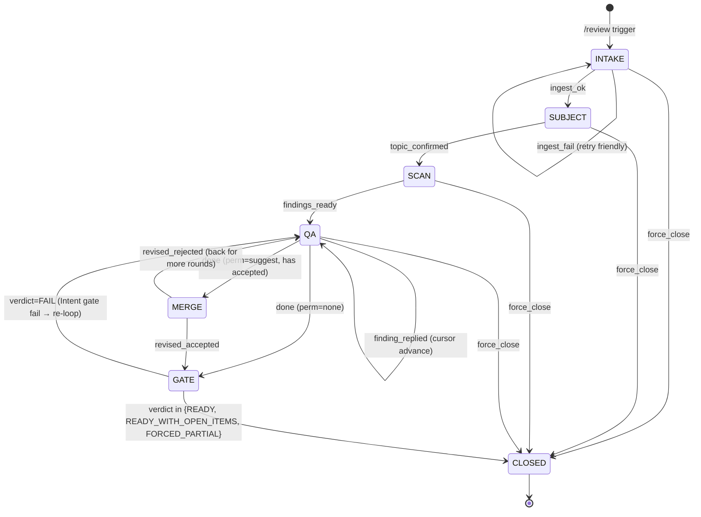

# M1.1 Stage A · Review Skill v0.1 spec brief

> Stage A 的目标是 **能在 5 分钟内向一个没看过 PAID 的人讲清整个 review
> skill 的结构 + 核心风险**。完整 architecture 在 04 文档（700 行）；这份是
> 浓缩版给设计 review 用。
>
> **通过条件**（design/05_backlog.md M1 §3 Stage A 门）：
> 1. Jimmy 自己读完能 5 min 解释给一个陌生人
> 2. 能列至少 3 个潜在风险点（见 §6）
> 3. 没通过 → 回头补 spec，**不允许跳到 Stage B 写代码**

---

## 1. 角色 + 边界

| 谁 | 在 PAID 里是什么 | review 里是什么 |
|---|---|---|
| Owner | `paid.identity.Owner` | Responder + Admin（合体）|
| Junior counterparty | `cp.role="junior"` | Requester（提交 draft 的人）|

**v0.1 范围**：单 owner，每个 junior cp **最多 1 个并发 session**，session 全在 1:1 DM 里走完。多 Responder / 群聊 / 并发 session 留 v1。

---

## 2. 触发面（关键，跟 backlog M1 §2 一致）

**唯一入口**：junior DM 里以 `/review` 或 `/r` 开头的消息。

```
junior 发: /review Q3 营销预算草稿
           ↓
PAID plugin pre_llm_call hook 看到 user_message.startswith('/review')
           ↓
路由到 paid_review.api (绕过 classifier / decision)
```

**classifier 自动触发延后**：
- `Classification.needs_review` 字段保持（v1.0.0 R-B3 已实装），LLM 仍然填
- `decision.decide_action` v0.1 **不走** `needs_review=True → state=review` 这条规则（即 backlog 描述的"dead code 路径"）
- 单元测试里这条规则被 mark 为 `pytest.skip(reason="M1 v0.1 disabled until M1.7")`
- M1.7 子任务跟踪：M1 dogfood 一周后单独评估开关

**回归保证**：不发 `/review` 的所有 inbound 走完全不变的旧链路。

---

## 3. 7 stage 状态机



**关键 invariant**：从任意 stage 走到 `CLOSED` 之后，**owner.json + cp.profile.json 状态都被清干净**（`active_review_session=""`），同 cp 下次 `/review` 是全新 session。

---

## 4. SessionState dataclass（minimum surface）

```python
@dataclass
class SessionState:
    sid: str                       # uuid4 short (12 chars)
    schema_version: int = 1
    created_at: str = ""
    updated_at: str = ""
    cp_id: str = ""                # PAID cp identity
    owner_id: str = ""
    platform: str = ""             # tg | lark | slack
    stage: Stage = "INTAKE"
    subject: str | None = None     # set after SUBJECT
    rounds: int = 0
    max_rounds: int = 3
    verdict: Verdict = "PENDING"
    doc_edit_permission: Literal["none","suggest","direct"] = "suggest"
    forced: bool = False
    closed_at: str | None = None
    last_event_kind: str = ""
    llm_cost_usd: float = 0.0
    trace_id: str | None = None
```

存 `~/.hermes/paid/review/sessions/<sid>/meta.json`。
所有变更走 `state.transition(s, new_stage)` —— 单点校验合法转移 + stamp `updated_at`。

`Stage = Literal["INTAKE","SUBJECT","SCAN","QA","MERGE","GATE","CLOSED"]`
`Verdict = Literal["READY","READY_WITH_OPEN_ITEMS","FORCED_PARTIAL","FAIL","PENDING"]`

---

## 5. `paid_review/api.py` 5 函数签名（plugin 唯一入口）

```python
@dataclass
class ReviewReply:
    text: str                      # 要发给 junior 的字面文本（已套选项块）
    stage: Stage
    event_kind: str                # intake_ack / subject_ask / finding / close_propose / ...
    closed: bool = False           # True 时调用方应清 active_review_session


def intake(*, cp, initial_message, attachments, classification=None) -> str:
    """Create a session, return sid. cp must have role=junior."""

def handle_inbound(sid: str, text: str, hook_kwargs: dict) -> ReviewReply:
    """Drive state machine one step using junior's reply."""

def list_open(owner_id: str | None = None) -> str:
    """Markdown table for /review pending owner cmd."""

def show(sid: str) -> str:
    """Markdown summary of one session for /review show <id>."""

def force_close(sid: str, *, reason: str = "") -> str:
    """force-close session; verdict=FORCED_PARTIAL; archive."""
```

**调用约定**：
- plugin glue (Stage B sprint D) **同步**调这 5 个 function
- 所有 LLM call 在 `api.py` **内部**走 `paid.hermes_io.call_llm`（自动写 cost ledger）
- `api.py` 函数**永不抛异常进 plugin**：包 try/except，错误时 return `ReviewReply(text="<friendly>", stage=...)` + log 到 `~/.hermes/paid/audit_log.jsonl` 加 `kind="review.error"`

---

## 6. plugin ↔ skill 接口逐 stage 输入输出

| Stage | plugin → skill 输入 | skill → plugin 输出 | 异常路径 |
|---|---|---|---|
| **INTAKE** | `cp` (identity.Counterparty), `initial_message` (含 `/review`), `attachments` (hook_kwargs.attachments) | `ReviewReply(text=<subject 候选选项块>, stage=SUBJECT)` | ingest 失败 → `text=<friendly 提示贴正文>, stage=INTAKE`（保留 stage 等用户重发）|
| **SUBJECT** | session 中 junior 回 `a/b/c/pass/custom...` | `ReviewReply(text=<第一条 finding>, stage=QA)` | 不可解析回复 → `text="不懂，请回 a/b/c 或自由文本"`, 不前进 |
| **SCAN** | (内部 stage，不直接外部触发；INTAKE→SUBJECT confirm 之后立刻同步跑 4-pillar+sim) | (与 QA 第一条合并)；SCAN > 60s 中间发 1 条进度 | LLM 超时 retry 2 次仍失败 → `text="脑子卡了再发一次"`, stage=SUBJECT 回退 |
| **QA** | junior 回复（短码 / 自由文本）| `ReviewReply(text=<下一条 finding 或 close_propose>, stage=QA)` | finding cursor 空 + Intent pass → 进 MERGE/GATE |
| **MERGE** | junior 对 revised.md 回 `a/b/c/(custom)` | `ReviewReply(text=<gate 结果>, stage=GATE)` | revised 生成失败 → 退回 QA 让 junior 自上传 final |
| **GATE** | (内部，MERGE 完跑或 perm=none 直接进) | `ReviewReply(text="<6 节 brief delivered>"+done, stage=CLOSED, closed=True)` | verdict=FAIL（Intent 柱回归）→ 退回 QA + 加新 finding |
| **CLOSED** | junior 之后再发任何东西 | `ReviewReply(text="<session 已关>...", stage=CLOSED, closed=True)` | 不重开 sid，提示 `/review <new>` |

**plugin 唯一职责**：
1. `pre_llm_call` 看到 `text.startswith("/review")` 或 `cp.active_review_session != ""` → 调 `api.intake()` 或 `api.handle_inbound()`
2. 收 `ReviewReply` → return `{"reply_override": reply.text, "skip_llm": True}` 给 hermes（v1.0.0 已验证 fallback 路径用 `IGNORE the user question. Reply EXACTLY with: '...'`）
3. `reply.closed=True` → 调 `identity.clear_active_review_session(cp, archive=...)`

skill **永不**直接调 hermes_io.send_dm（出站全靠 plugin return + hermes 自己发）。**例外**：MERGE/GATE/CLOSED 阶段把 6 节 brief deliver 给 owner 时**走 plugin 帮转**，不直接 send。

---

## 7. 文件树（运行时）

```
~/.hermes/paid/                     ← PAID 主目录（已存在）
├── owner.json
├── counterparties/<cp_id>/profile.json   (active_review_session 字段已 v2)
├── audit_log.jsonl                      (kind: review.* 共享同 audit)
└── review/                              ← skill 数据子目录
    ├── installed.json
    ├── review_rules.md                  (live, owner editable)
    ├── responder_profile.md             (live; install 时从 persona+sop 拼初稿)
    ├── admin_style.md
    ├── delivery_targets.json
    └── sessions/
        ├── <sid>/
        │   ├── meta.json                ← SessionState
        │   ├── input/                    ← 原始附件
        │   ├── normalized.md
        │   ├── annotations.jsonl
        │   ├── cursor.json
        │   ├── dissent.md
        │   ├── final_gate.json
        │   ├── final/{revised.md, <primary>.md}
        │   ├── summary.md
        │   ├── summary_audit.md
        │   ├── conversation.jsonl
        │   └── frozen/{review_rules,responder_profile,admin_style}.md
        └── _closed/<YYYY-MM>/<sid>/...
```

---

## 8. ⚠️ 风险点（review gate 要求 ≥3 条）

### R1 · `pre_llm_call` 重路由把 J2 主链路打回归
所有 `text.startswith('/review')` inbound 必须 **跳过** classifier + decision，但其他 99% inbound 不能受影响。Sprint D 改 plugin glue 时如果 dispatch 顺序错了，可能把所有 inbound 都路由进 review skill。**Mitigation**：Sprint D 完成必跑 `tests/test_alert_owner.py` + `tests/test_send_dm_dispatch.py` + `tests/test_review_integration.py` —— 这三套合起来覆盖了 J2/J3/J4 全部正常路径，红任何一个就回滚 D commit。

### R2 · cp profile.active_review_session 字段没清干净
session close 时若 plugin 没 catch `reply.closed=True` 或 `clear_active_review_session` raise，下次同 junior 任何消息都被路由进死 sid → junior 端体验是"不管发什么 PAID 都说 session 已关"。**Mitigation**：plugin glue 用 try/except 包 dispatch；cp profile 加一个"session_id 不在 sessions/ 找不到 → 自动清"的 self-heal（在 `identity.load_counterparty` 或 hook 入口）。

### R3 · LLM 调用 cost 失控
4-pillar scan + Responder Sim + Q&A 每轮都打 LLM，6 节 summary 又一次。一个 session 估算 8-15 次 call，每次 1-2k tokens。10 个并发 session = 100+ call。**Mitigation**：
- `SessionState.llm_cost_usd` 累计每次 call 后读回（hermes_io 已写 ledger，加返回 cost 字段就够）
- 单 session > $1.0 强制 force-close verdict=FORCED_PARTIAL（04 文档 §12 已写）
- v1.2.3 daily cap 已上线，cron 检查兜底

### R4 · Cross-cp 数据泄漏
session 数据在 `sessions/<sid>/`，但读路径有任何一个写错（比如 LLM prompt 里 leak 别 cp 的内容），就是商业化致命问题。**Mitigation**：每个 LLM call 的 user message **只能含本 sid 文件夹下的文件 + cp.profile.json 自己的**。Sprint A 加单测：构造 2 个 session，确认 sid_A 的 LLM call prompt 不含 sid_B 的任何字符串。

### R5 · Ingest backend 失败把 stage 卡住
PDF/图片/音频 ingest 调外部工具（pdftotext / tesseract / whisper），任何一个挂掉 → INTAKE → SUBJECT 转换 fail。**Mitigation**：每个 backend 独立 try/except；全部失败 → 返回 friendly fallback "贴正文吧"，session 留在 INTAKE 等用户重发（**不**直接 force_close — 给 user 修正机会）。

---

## 9. Stage A 通过 → Stage B sprint 顺序（参 04 §14）

| Sprint | 内容 | 完成判据（每 sprint 自带） |
|---|---|---|
| A | state.py / cursor.py / annotation.py + api.py 骨架 + happy path 集成测试 | sprint A 测试 100% + PAID 332 回归 0 退化 |
| B | scan.py 4-pillar + Responder Sim + qa.py finding 渲染 + reply 分类 | + reject/dissent/unresolvable 集成测试 |
| C | final_gate.py + build_summary.py + build_audit.py + deliver.py | + 6 节 summary 完整 |
| D | plugin glue: `/review` 命令拦截 + active session 路由 + state=review handoff | **R1 回归三套全过** + 新增 e2e_smoke.sh |
| E | ingest.py + install.sh + uninstall.sh + doctor.py + 端到端冒烟 | dogfood 5 项 (Stage C) |

每个 sprint 完成 → 跑 `python3 -m pytest tests/ && python3 bin/manual_smoke.py` —— 332 + 63 都过才进下一 sprint。任一退化立刻 `git reset --hard` 该 sprint commit。

---

## 10. 不在 v0.1 scope（防止 Sprint 期间 scope 蠕变）

- ❌ Multi-Responder（owner 把审稿权委派同事）
- ❌ Group chat @ trigger
- ❌ `direct` 文档编辑权限（直改 Lark Doc）
- ❌ Lark Doc inline comments
- ❌ Email backend
- ❌ Google Doc ingest
- ❌ Classifier 自动触发（M1.7 评估）
- ❌ Owner-side review session dashboard tab（M1 v0.1 用 `/review pending` 文本即可）
- ❌ Force-close 之前的 grace period（直接 close）
- ❌ session 之间的状态共享 / context 继承

任何冲动想加，先看这条表 — 在表上的，**强制留 v1**。

---

## 附录 · 跟 04 文档对照位置

| 本 spec § | 04 文档对应 |
|---|---|
| §3 状态机 | §3.1-3.8 detail |
| §4 SessionState | §2.1 |
| §5 api.py | §3.1 + §1 (api.py 行) |
| §6 plugin↔skill 接口 | §3 详细每 stage 处理 + §15 落地待办 |
| §7 文件树 | §5 |
| §8 风险 | §8 (并发) + §11 (安全) + §12 (性能) |
