# M1.1 Stage A · Review Skill v0.1 spec brief

> Stage A 的目标是 **能在 5 分钟内向一个没看过 PAID 的人讲清整个 review
> skill 的结构 + 核心风险**。完整 architecture 在 04 文档（700 行）；这份是
> 浓缩版给设计 review 用。
>
> **通过条件**（design/05_backlog.md M1 §3 Stage A 门）：
> 1. Jimmy 自己读完能 5 min 解释给一个陌生人
> 2. 能列至少 3 个潜在风险点（见 §8）
> 3. 没通过 → 回头补 spec，**不允许跳到 Stage B 写代码**
>
> **draft 2 修订**（圈号标记下文位置）：
> - Ⓜ1 状态图补 SCAN → SUBJECT 回退边
> - Ⓜ2 状态图补 MERGE / GATE → CLOSED (force_close) 边
> - Ⓜ3 状态图加 QA → CLOSED (rounds_exhausted) + invariant §3.1
> - Ⓜ4 §6 QA→MERGE 的 done 条件精确化（所有 finding 已 reply）
> - Ⓜ5 §3.1 round 计数规则：任何 stage→QA 都 +1
> - Ⓜ6 §11 session TTL 24h + cron 扫描机制
> - Ⓜ7 §6 plugin 入口加 cp 并发保护
> - Ⓜ8 §6 SCAN 进度消息 ReviewReply 约定
> - Ⓜ9 §3.1 verdict 规则：任何 force_close → FORCED_PARTIAL
> - Ⓜ10 §12 6 节 brief 标题清单
> - Ⓜ11 §13 process restart recovery
> - Ⓜ12 §14 cursor.json schema

---

## 1. 角色 + 边界

| 谁 | 在 PAID 里是什么 | review 里是什么 |
|---|---|---|
| Owner | `paid.identity.Owner` | Responder + Admin（合体）|
| Junior counterparty | `cp.role="junior"` | Requester（提交 draft 的人）|

**v0.1 范围**：单 owner，每个 junior cp **最多 1 个并发 session**，session 全在 1:1 DM 里走完。多 Responder / 群聊 / 并发 session 留 v1。

---

## 2. 触发面（关键，跟 backlog M1 §2 一致）

**唯一入口**：junior DM 里以 `/review` 或 `/r` 开头的消息。

```
junior 发: /review Q3 营销预算草稿
           ↓
PAID plugin pre_llm_call hook 看到 user_message.startswith('/review')
           ↓
路由到 paid_review.api (绕过 classifier / decision)
```

**classifier 自动触发延后**：
- `Classification.needs_review` 字段保持（v1.0.0 R-B3 已实装），LLM 仍然填
- `decision.decide_action` v0.1 **不走** `needs_review=True → state=review` 这条规则（即 backlog 描述的"dead code 路径"）
- 单元测试里这条规则被 mark 为 `pytest.skip(reason="M1 v0.1 disabled until M1.7")`
- M1.7 子任务跟踪：M1 dogfood 一周后单独评估开关

**回归保证**：不发 `/review` 的所有 inbound 走完全不变的旧链路。

---

## 3. 7 stage 状态机

```mermaid
stateDiagram-v2
    [*] --> INTAKE : /review trigger
    INTAKE --> SUBJECT : ingest_ok
    INTAKE --> INTAKE : ingest_fail (retry friendly)

    SUBJECT --> SCAN : topic_confirmed

    SCAN --> QA : findings_ready
    SCAN --> SUBJECT : llm_timeout (after 2 retries) %% Ⓜ1

    QA --> QA : finding_replied (cursor advance)
    QA --> MERGE : done (perm=suggest, all findings replied) %% Ⓜ4
    QA --> GATE : done (perm=none, all findings replied) %% Ⓜ4
    QA --> CLOSED : rounds >= max_rounds %% Ⓜ3

    MERGE --> GATE : revised_accepted
    MERGE --> QA : revised_rejected (rounds += 1) %% Ⓜ5

    GATE --> CLOSED : verdict in {READY, READY_WITH_OPEN_ITEMS}
    GATE --> QA : verdict=FAIL (Intent gate fail; rounds += 1) %% Ⓜ5

    %% Ⓜ2 force_close is the universal escape hatch — applies to ALL stages.
    INTAKE --> CLOSED : force_close
    SUBJECT --> CLOSED : force_close
    SCAN --> CLOSED : force_close
    QA --> CLOSED : force_close
    MERGE --> CLOSED : force_close
    GATE --> CLOSED : force_close

    CLOSED --> [*]
```



### 3.1 状态机 Invariants

> 任何代码改动违反下面任意一条都视为状态机 bug。

**INV-1 · force_close 全 stage 通用**（Ⓜ2）
`api.force_close(sid, reason)` 从任何非 CLOSED stage 调都合法；强制走到 CLOSED 并设 `verdict=FORCED_PARTIAL`（Ⓜ9）+ `forced=True` + `closed_at=now`。

**INV-2 · 任何回 QA 都 += 1 round**（Ⓜ5）
`MERGE → QA`（revised rejected）和 `GATE → QA`（verdict=FAIL）都计 round。即 `rounds` 是"进 QA 的总次数"，不是"junior 在 QA 里发的总消息数"。
- 默认 `max_rounds=3`，env `PAID_REVIEW_MAX_ROUNDS=5` 可调（hard ceiling 5）
- `rounds >= max_rounds` 进 QA 时 → 自动 force_close + `verdict=FORCED_PARTIAL`（Ⓜ3）

**INV-3 · QA 不能 done 当还有 open finding**（Ⓜ4）
`done` (perm=suggest → MERGE 或 perm=none → GATE) 触发条件：cursor.pending 空 AND cursor.deferred 空 AND **所有 annotations.jsonl 里 status=open 的 finding 都已 reply**。有 open → bot 回 `"还有 N 条 finding 没回，继续 (a)/(b)/(c) 或 (skip) 跳过"`，stage 不变。

**INV-4 · CLOSED 后 cp.active_review_session 清空**
不论怎么 close，plugin glue 必须 `identity.clear_active_review_session(cp, archive=...)`。同 cp 下一条 `/review` = 全新 sid。

**INV-5 · verdict 设置**（Ⓜ9）
- 正常走完 GATE → READY / READY_WITH_OPEN_ITEMS / FAIL（FAIL 不到 CLOSED 而是回 QA）
- 任何 force_close（包括 INTAKE/SUBJECT/SCAN/QA/MERGE/GATE 阶段）→ **FORCED_PARTIAL**
- 不允许 `verdict=PENDING` 且 `stage=CLOSED` 的状态出现（self-check 单测覆盖）

---

## 4. SessionState dataclass（minimum surface）

```python
@dataclass
class SessionState:
    sid: str                       # uuid4 short (12 chars)
    schema_version: int = 1
    created_at: str = ""
    updated_at: str = ""
    last_inbound_at: str = ""      # Ⓜ6 — TTL 计算锚点；任何 junior reply 后 stamp
    cp_id: str = ""                # PAID cp identity
    owner_id: str = ""
    platform: str = ""             # tg | lark | slack
    stage: Stage = "INTAKE"
    subject: str | None = None     # set after SUBJECT
    rounds: int = 0
    max_rounds: int = 3
    verdict: Verdict = "PENDING"
    doc_edit_permission: Literal["none","suggest","direct"] = "suggest"
    forced: bool = False
    closed_at: str | None = None
    last_event_kind: str = ""      # for replay / debug; Ⓜ11 recovery 锚点
    llm_cost_usd: float = 0.0
    trace_id: str | None = None
```

存 `~/.hermes/paid/review/sessions/<sid>/meta.json`。
所有变更走 `state.transition(s, new_stage)` —— 单点校验合法转移 + stamp `updated_at`。

`Stage = Literal["INTAKE","SUBJECT","SCAN","QA","MERGE","GATE","CLOSED"]`
`Verdict = Literal["READY","READY_WITH_OPEN_ITEMS","FORCED_PARTIAL","FAIL","PENDING"]`

---

## 5. `paid_review/api.py` 5 函数签名（plugin 唯一入口）

```python
@dataclass
class ReviewReply:
    text: str                      # 要发给 junior 的字面文本（已套选项块）
    stage: Stage
    event_kind: str                # intake_ack / subject_ask / finding /
                                   # scan_progress / close_propose / ...  Ⓜ8
    closed: bool = False           # True 时调用方应清 active_review_session


class IntakeRefused(Exception):
    """Ⓜ7 — intake() raises if cp already has active_review_session."""


def intake(*, cp, initial_message, attachments, classification=None) -> str:
    """Create a session, return sid.

    Raises IntakeRefused if cp.active_review_session is already set —
    plugin must catch + send a friendly reply to the junior. v0.1 hard
    rule: at most 1 concurrent session per cp.    Ⓜ7
    """

def handle_inbound(sid: str, text: str, hook_kwargs: dict) -> ReviewReply:
    """Drive state machine one step using junior's reply.
    Stamps state.last_inbound_at = now on entry (Ⓜ6 TTL anchor)."""

def list_open(owner_id: str | None = None) -> str:
    """Markdown table for /review pending owner cmd."""

def show(sid: str) -> str:
    """Markdown summary of one session for /review show <id>."""

def force_close(sid: str, *, reason: str = "") -> str:
    """Force-close session from ANY non-CLOSED stage.
    verdict=FORCED_PARTIAL, forced=True, closed_at=now (Ⓜ9, INV-5)."""
```

**调用约定**：
- plugin glue (Stage B sprint D) **同步**调这 5 个 function
- 所有 LLM call 在 `api.py` **内部**走 `paid.hermes_io.call_llm`（自动写 cost ledger）
- `api.py` 函数**永不抛异常进 plugin**（除显式 `IntakeRefused`）：包 try/except，错误时 return `ReviewReply(text="<friendly>", stage=...)` + log 到 `~/.hermes/paid/audit_log.jsonl` 加 `kind="review.error"`

---

## 6. plugin ↔ skill 接口逐 stage 输入输出

| Stage | plugin → skill 输入 | skill → plugin 输出 | 异常路径 |
|---|---|---|---|
| **入口** | text.startswith('/review' or '/r')；plugin 必先查 `cp.active_review_session` (Ⓜ7) — 已存在 → 不调 intake，直接 reply `"你已有进行中的 review session: /review show <sid>，先关掉再开新的"` | (跳过) | (跳过) |
| **INTAKE** | `cp`, `initial_message`, `attachments` | `ReviewReply(text=<subject 候选选项块>, stage=SUBJECT)` | ingest 失败 → `text=<friendly 提示贴正文>, stage=INTAKE`（保留 stage 等用户重发）|
| **SUBJECT** | session 中 junior 回 `a/b/c/pass/custom...` | `ReviewReply(text=<第一条 finding>, stage=QA)` | 不可解析回复 → `text="不懂，请回 a/b/c 或自由文本"`, 不前进 |
| **SCAN** | (内部 stage，不直接外部触发；INTAKE→SUBJECT confirm 之后立刻同步跑 4-pillar+sim) | (与 QA 第一条合并)；SCAN > 60s 中间发 `ReviewReply(text="<进度文字>", stage=SCAN, event_kind="scan_progress")` — Ⓜ8 plugin 看到 stage=SCAN + event_kind=scan_progress 时只 send 不写 meta，正常 ReviewReply 才写 meta | LLM 超时 retry 2 次仍失败 → `text="脑子卡了再发一次", stage=SUBJECT` 回退（Ⓜ1）|
| **QA** | junior 回复（短码 / 自由文本）| `ReviewReply(text=<下一条 finding 或 close_propose>, stage=QA)` | rounds >= max_rounds → 自动 `force_close + verdict=FORCED_PARTIAL`，return `ReviewReply(text="3 轮 review 上限，剩余 finding 进 open_items；session 关闭", stage=CLOSED, closed=True)` (Ⓜ3) |
| **QA done 触发** | junior 回 `done` | `done` 触发条件：cursor.pending 空 AND cursor.deferred 空 AND 所有 open finding 已 reply (Ⓜ4)。满足 → 进 MERGE (perm=suggest) / GATE (perm=none)；不满足 → `text="还有 N 条 finding 没回，继续 (a)/(b)/(c) 或 (skip)"`, stage=QA 不变 |
| **MERGE** | junior 对 revised.md 回 `a/b/c/(custom)` | `ReviewReply(text=<gate 结果>, stage=GATE)` | revised 生成失败 → 退回 QA `rounds += 1` 让 junior 自上传 final (Ⓜ5)；rounds 超限即触发 INV-2 force_close |
| **GATE** | (内部，MERGE 完跑或 perm=none 直接进) | `ReviewReply(text="<6 节 brief delivered>"+done, stage=CLOSED, closed=True)` | verdict=FAIL（Intent 柱回归）→ 退回 QA `rounds += 1` 加新 finding (Ⓜ5)；rounds 超限即 force_close |
| **CLOSED** | junior 之后再发任何东西 | `ReviewReply(text="<session 已关>...", stage=CLOSED, closed=True)` | 不重开 sid，提示 `/review <new>` |

**plugin 唯一职责**：
1. **入口并发保护**（Ⓜ7）`pre_llm_call` 看 `text.startswith("/review")` → 先查 `cp.active_review_session`：
   - 已有 sid → 直接 reply 拒绝（不调 intake）
   - 无 sid → 调 `api.intake()` 拿新 sid → 调 `identity.set_active_review_session(cp, sid)`
2. `pre_llm_call` 看 `cp.active_review_session != ""` 且 text 不以 `/review` 开头 → 调 `api.handle_inbound(sid, text, hook_kwargs)`
3. 收 `ReviewReply` → return `{"reply_override": reply.text, "skip_llm": True}` 给 hermes（v1.0.0 已验证 fallback 路径用 `IGNORE the user question. Reply EXACTLY with: '...'`）
4. **stage=SCAN + event_kind=scan_progress** 特殊路径（Ⓜ8）：plugin 只 return reply_override，**不**调 `clear_active_review_session`（session 还活着，只是发了个进度消息）
5. `reply.closed=True` → 调 `identity.clear_active_review_session(cp, archive=...)`

skill **永不**直接调 hermes_io.send_dm（出站全靠 plugin return + hermes 自己发）。**例外**：MERGE/GATE/CLOSED 阶段把 6 节 brief deliver 给 owner 时**走 plugin 帮转**，不直接 send。

---

## 7. 文件树（运行时）

```
~/.hermes/paid/                     ← PAID 主目录（已存在）
├── owner.json
├── counterparties/<cp_id>/profile.json   (active_review_session 字段已 v2)
├── audit_log.jsonl                      (kind: review.* 共享同 audit)
└── review/                              ← skill 数据子目录
    ├── installed.json
    ├── review_rules.md                  (live, owner editable)
    ├── responder_profile.md             (live; install 时从 persona+sop 拼初稿)
    ├── admin_style.md
    ├── delivery_targets.json
    └── sessions/
        ├── <sid>/
        │   ├── meta.json                ← SessionState
        │   ├── input/                    ← 原始附件
        │   ├── normalized.md
        │   ├── annotations.jsonl
        │   ├── cursor.json
        │   ├── dissent.md
        │   ├── final_gate.json
        │   ├── final/{revised.md, <primary>.md}
        │   ├── summary.md
        │   ├── summary_audit.md
        │   ├── conversation.jsonl
        │   └── frozen/{review_rules,responder_profile,admin_style}.md
        └── _closed/<YYYY-MM>/<sid>/...
```

---

## 8. ⚠️ 风险点

### R1 · `pre_llm_call` 重路由把 J2 主链路打回归
所有 `text.startswith('/review')` inbound 必须 **跳过** classifier + decision，但其他 99% inbound 不能受影响。Sprint D 改 plugin glue 时如果 dispatch 顺序错了，可能把所有 inbound 都路由进 review skill。**Mitigation**：Sprint D 完成必跑 `tests/test_alert_owner.py` + `tests/test_send_dm_dispatch.py` + `tests/test_review_integration.py` —— 这三套合起来覆盖了 J2/J3/J4 全部正常路径，红任何一个就回滚 D commit。

### R2 · cp profile.active_review_session 字段没清干净
session close 时若 plugin 没 catch `reply.closed=True` 或 `clear_active_review_session` raise，下次同 junior 任何消息都被路由进死 sid → junior 端体验是"不管发什么 PAID 都说 session 已关"。**Mitigation**：plugin glue 用 try/except 包 dispatch；cp profile 加一个"session_id 不在 sessions/ 找不到 → 自动清"的 self-heal（在 `identity.load_counterparty` 或 hook 入口）。

### R3 · LLM 调用 cost 失控
4-pillar scan + Responder Sim + Q&A 每轮都打 LLM，6 节 summary 又一次。一个 session 估算 8-15 次 call，每次 1-2k tokens。10 个并发 session = 100+ call。**Mitigation**：
- `SessionState.llm_cost_usd` 累计每次 call 后读回（hermes_io 已写 ledger，加返回 cost 字段就够）
- 单 session > $1.0 强制 force-close verdict=FORCED_PARTIAL（04 文档 §12 已写）
- v1.2.3 daily cap 已上线，cron 检查兜底

### R4 · Cross-cp 数据泄漏
session 数据在 `sessions/<sid>/`，但读路径有任何一个写错（比如 LLM prompt 里 leak 别 cp 的内容），就是商业化致命问题。**Mitigation**：每个 LLM call 的 user message **只能含本 sid 文件夹下的文件 + cp.profile.json 自己的**。Sprint A 加单测：构造 2 个 session，确认 sid_A 的 LLM call prompt 不含 sid_B 的任何字符串。

### R5 · Ingest backend 失败把 stage 卡住
PDF/图片/音频 ingest 调外部工具（pdftotext / tesseract / whisper），任何一个挂掉 → INTAKE → SUBJECT 转换 fail。**Mitigation**：每个 backend 独立 try/except；全部失败 → 返回 friendly fallback "贴正文吧"，session 留在 INTAKE 等用户重发（**不**直接 force_close — 给 user 修正机会）。

### R6 · Junior 失联，session 永远卡住（draft 2 加）
Junior 发完 `/review` 选完 subject 就消失（断网 / 改主意 / 突发事），cp.active_review_session 永远占着，下次该 cp 再发 `/review` 被 §6 入口并发保护拒绝 → 体验死锁。**Mitigation**：见 §11 — 24h 无活动 sweep + auto force_close。

### R7 · 同 cp 并发请求竞态（draft 2 加）
异步 IM 不保证消息有序：junior 0.1s 内连发 `/review A` + `/review B`，两个 hook 同时跑都看到 `active_review_session=""`，都进 intake() 创建 sid → state corruption。**Mitigation**：
- 短期：v0.1 接受 race 偶发风险（单 owner 单 junior pilot 概率极低），加 `identity.set_active_review_session` 内置原子写 + `ReviewSessionConflict` 异常（v1.0.0 已实装）
- 长期：M1 dogfood 一周后看是否真撞，撞了再加 fcntl 文件锁（design/01 §4 跳过项里有"fcntl 文件锁"，撞了就把这条加回来）

### R8 · 进程崩溃后状态丢失（draft 2 加）
hermes restart 中途 kill plugin 进程，meta.json 写到一半（只有 stage 没有 cursor 推进）；junior 下条消息进来时读到的是 inconsistent state。**Mitigation**：见 §13 — meta.json 写用 tmp+rename 原子；recovery hook 加"刚才断了，继续"recover 消息。

---

## 9. Stage A 通过 → Stage B sprint 顺序（参 04 §14）

| Sprint | 内容 | 完成判据（每 sprint 自带） |
|---|---|---|
| A | state.py / cursor.py / annotation.py + api.py 骨架 + happy path 集成测试 | sprint A 测试 100% + PAID 332 回归 0 退化 |
| B | scan.py 4-pillar + Responder Sim + qa.py finding 渲染 + reply 分类 | + reject/dissent/unresolvable 集成测试 |
| C | final_gate.py + build_summary.py + build_audit.py + deliver.py | + 6 节 summary 完整 |
| D | plugin glue: `/review` 命令拦截 + active session 路由 + state=review handoff | **R1 回归三套全过** + 新增 e2e_smoke.sh |
| E | ingest.py + install.sh + uninstall.sh + doctor.py + 端到端冒烟 | dogfood 5 项 (Stage C) |

每个 sprint 完成 → 跑 `python3 -m pytest tests/ && python3 bin/manual_smoke.py` —— 332 + 63 都过才进下一 sprint。任一退化立刻 `git reset --hard` 该 sprint commit。

---

## 10. 不在 v0.1 scope（防止 Sprint 期间 scope 蠕变）

- ❌ Multi-Responder（owner 把审稿权委派同事）
- ❌ Group chat @ trigger
- ❌ `direct` 文档编辑权限（直改 Lark Doc）
- ❌ Lark Doc inline comments
- ❌ Email backend
- ❌ Google Doc ingest
- ❌ Classifier 自动触发（M1.7 评估）
- ❌ Owner-side review session dashboard tab（M1 v0.1 用 `/review pending` 文本即可）
- ❌ Force-close 之前的 grace period（直接 close）
- ❌ session 之间的状态共享 / context 继承
- ❌ fcntl 文件锁（如果 R7 真撞再加）

任何冲动想加，先看这条表 — 在表上的，**强制留 v1**。

---

## 11. Session TTL + cron 清理（Ⓜ6）

**问题** (R6)：junior 中途消失，cp.active_review_session 永久占着。

**v0.1 设计**：
- `SessionState.last_inbound_at` 字段（§4 已加）— 每次 `handle_inbound()` 入口 stamp now
- 默认 `PAID_REVIEW_SESSION_TTL_HOURS=24`（设可调，hard ceiling 72h）
- 新建 `bin/sweep_review_sessions.py`：cron 每小时跑：
  1. 扫 `~/.hermes/paid/review/sessions/<sid>/meta.json` 全部 `stage != CLOSED`
  2. `now - last_inbound_at > TTL` → 调 `api.force_close(sid, reason="TTL expired")`
  3. force_close 自动设 `verdict=FORCED_PARTIAL` (INV-5) + 清 cp.active_review_session
- cron 入口仿 `bin/check_cost_cap.py` (v1.2.3)：`/etc/cron.d/paid-review-sweep`，每小时

**与 J3 timeout 的区别**：
- J3 `bin/sweep_pending.py` (v0.5+) 扫 pending_approvals.jsonl
- M1 `bin/sweep_review_sessions.py` (v1.3) 扫 review/sessions/*/meta.json
- 两者独立、不互相影响

---

## 12. 6 节 brief 定义（Ⓜ10）

GATE → CLOSED 时 `core/build_summary.py` 调 LLM 生成 `sessions/<sid>/summary.md`，**6 节固定结构**（参 04 §7 / 02 §7）：

```
# 会前简报 — <subject>

_Junior: <name> · Rounds: N · 产出时间: <ts>_

## 1. 议题摘要
   一句话 (20-40 字) + 三行背景 (why now / what's at stake / where it stands)

## 2. 核心数据
   关键数字带来源+日期；无来源标「未给出来源」作为风险信号

## 3. 团队自检结果
   - Findings 被挑战了几条
   - Junior 响应分布：接受并修改 / 保留异议 / 无解
   - Skill 对响应质量判断：强 / 中 / 弱 / 对抗性，带具体理由

## 4. 待决策事项
   - 主 ask（一句话）
   - 需要讨论的开放项 ≤ 3 条，带 A/B 判断框架

## 5. 建议时间分配
   每议题建议时长 + 原因。若材料未达 decision-ready，可建议「不开会」

## 6. 风险提示
   从六维度 + Responder Sim 综合，≤3 条
   每条标维度（数据/逻辑/可行/stakeholder/风险/ROI）+ 建议 owner 具体追问什么
```

风格：挑刺者视角，不软化 dissent，不隐藏 open items。

---

## 13. 进程崩溃 recovery（Ⓜ11）

**风险** (R8)：plugin 进程在 QA 中途 kill，meta.json 已写但 cursor.json 未推进。

**v0.1 mitigation**：
1. **原子写**：所有 meta.json / cursor.json / annotations 状态变更走 `paid.storage.write_json` (v1.0.0 已 fsync) — append jsonl 也已 fsync。tmp + rename 模式。
2. **recovery hook**：plugin 在 `pre_llm_call` 看到 `cp.active_review_session != ""` 时，调 `api.handle_inbound()` 之前先 lazy-check：
   - 加载 meta.json
   - 如果 `last_event_kind` 是 "scan_in_progress" 但 `stage` 是 SCAN 已超过 5 min → 推断进程崩溃过 → 返回 `ReviewReply(text="刚才好像断了，重新跑扫描... 给我一会儿", stage=SCAN, event_kind="scan_progress")` + 重启 SCAN
   - 其他 stage 的崩溃 → 信任 last meta.json 的 stage，正常处理
3. v0.1 不做更复杂的 transactional state machine — 接受偶发"重复一条 finding 提示"的不一致（junior 视角 ≈ 网络抖动），不接受丢 session 数据。

---

## 14. cursor.json schema（Ⓜ12）

QA loop 推进的核心数据结构（参 04 §2.3）：

```jsonc
{
  "current_id": "p3" | null,        // 当前在发的 finding；null = none active
  "pending":  ["p3", "r1", "p5"],   // 待发列表（按 severity 排序，top-N + deferred）
  "deferred": ["p7", "r3"],         // top-N 之外的，等 (more) 拉
  "done":     ["p1", "p2"]          // 已 accepted / rejected / modified / unresolvable
}
```

**`done` 判定**：finding `id` 转入 done 当 annotations.jsonl 对应 status ∈ {accepted, rejected, modified, unresolvable}。
**`pending` 推进规则**：handle_inbound 处理完一条回复后 `current_id` 移到 `done`，从 `pending` 弹下一个；空 → 进 close 提议（INV-3 检查所有 finding 已 reply）。
**`(more)` 命令**：把 deferred 的前 N 条挪到 pending。

---

## 附录 · 跟 04 文档对照位置

| 本 spec § | 04 文档对应 |
|---|---|
| §3 状态机 + invariants | §3.1-3.8 detail |
| §4 SessionState | §2.1 |
| §5 api.py | §3.1 + §1 (api.py 行) |
| §6 plugin↔skill 接口 | §3 详细每 stage 处理 + §15 落地待办 |
| §7 文件树 | §5 |
| §8 风险 | §8 (并发) + §11 (安全) + §12 (性能) |
| §11 TTL + sweep | §3 (close logic) + 04 没单独章节，本 spec 补 |
| §12 6 节 brief | §7 (output 规范) |
| §13 recovery | §8.2 (异常一致性) |
| §14 cursor schema | §2.3 |
